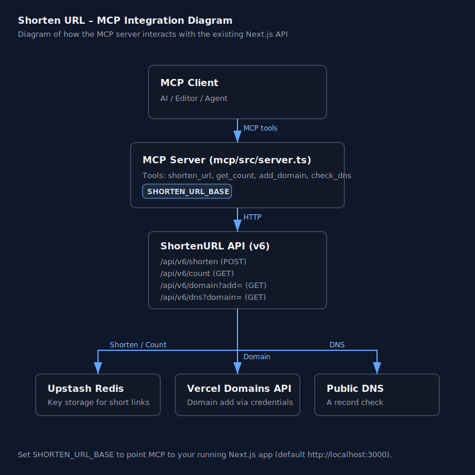

# Shorten URL MCP Server

A standalone Model Context Protocol (MCP) server that exposes tools for the shorten-url app using its v6 API endpoints. It does not modify your app code.

## Architecture



## Tools
- **shorten_url**: Shorten one or more URLs. Optional password protection.
  - Input: `{ urls: string, password?: string }`
  - Calls: `POST /api/v6/shorten`
  - Returns: Array of `{ key, url }`
- **get_count**: Get total number of stored short links (cached for ~5m).
  - Input: `{}`
  - Calls: `GET /api/v6/count`
  - Returns: `{ count: number }`
- **add_domain**: Add a domain to the Vercel project.
  - Input: `{ domain: string }`
  - Calls: `GET /api/v6/domain?add=...`
  - Returns: JSON from the API (error cleaned)
- **check_dns**: Verify domain A record points to expected IP ranges.
  - Input: `{ domain: string }`
  - Calls: `GET /api/v6/dns?domain=...`
  - Returns: Text result ("Setup Completed" or error)

## Configuration
- **SHORTEN_URL_BASE**: Base URL of the running Next.js app. Default: `http://localhost:3000`.

Your Next.js API already uses these env vars (MCP just forwards requests):
- `PROJECT_ID_VERCEL`, `TEAM_ID_VERCEL`, `AUTH_BEARER_TOKEN` (used by `pages/api/v6/domain.js`).

## Run
- Dev: `npm run dev`
- Build: `npm run build`
- Start: `npm start`

Run these commands from this directory after your Next.js app is running at `SHORTEN_URL_BASE`.

## File Structure
- `src/server.ts`: MCP server implementation
- `mcp.json`: Tool metadata/schema for MCP clients
- `package.json`, `tsconfig.json`: Build and TypeScript config

## Notes
- `shorten_url` accepts multiple URLs separated by newline or comma.
- If you pass `password`, the stored key will be password-protected on retrieval per app logic.

## Use with Cursor
Configure this MCP server in Cursor so the editor can call your tools directly.

- Example deployment base: `https://shareby.vercel.app/` ([site](https://shareby.vercel.app/))

### Quick config (dev)
If you want Cursor to run the dev server:

```json
{
  "mcpServers": {
    "shorten-url-mcp": {
      "command": "npx",
      "args": ["tsx", "watch", "src/server.ts"],
      "cwd": "./mcp",
      "env": {
        "SHORTEN_URL_BASE": "https://shareby.vercel.app/"
      }
    }
  }
}
```

### Quick config (built)
If you prefer to run the compiled server:

```json
{
  "mcpServers": {
    "shorten-url-mcp": {
      "command": "node",
      "args": ["dist/server.js"],
      "cwd": "./mcp",
      "env": {
        "SHORTEN_URL_BASE": "https://shareby.vercel.app/"
      }
    }
  }
}
```

Notes:
- Ensure your ShortenURL app is reachable at the `SHORTEN_URL_BASE` URL above.
- In Cursor, add this under Settings → Features → MCP (or your MCP JSON) and enable the server.
- Cursor will start/stop this MCP server automatically from the config; you don't need to run it manually.
